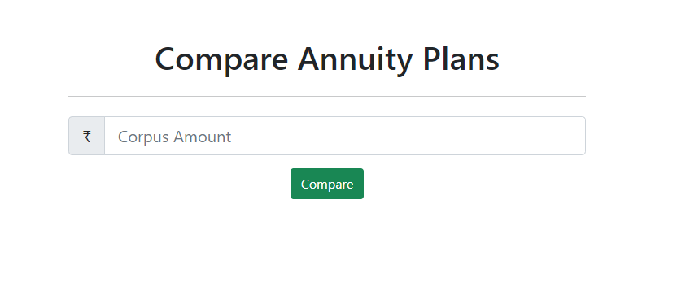
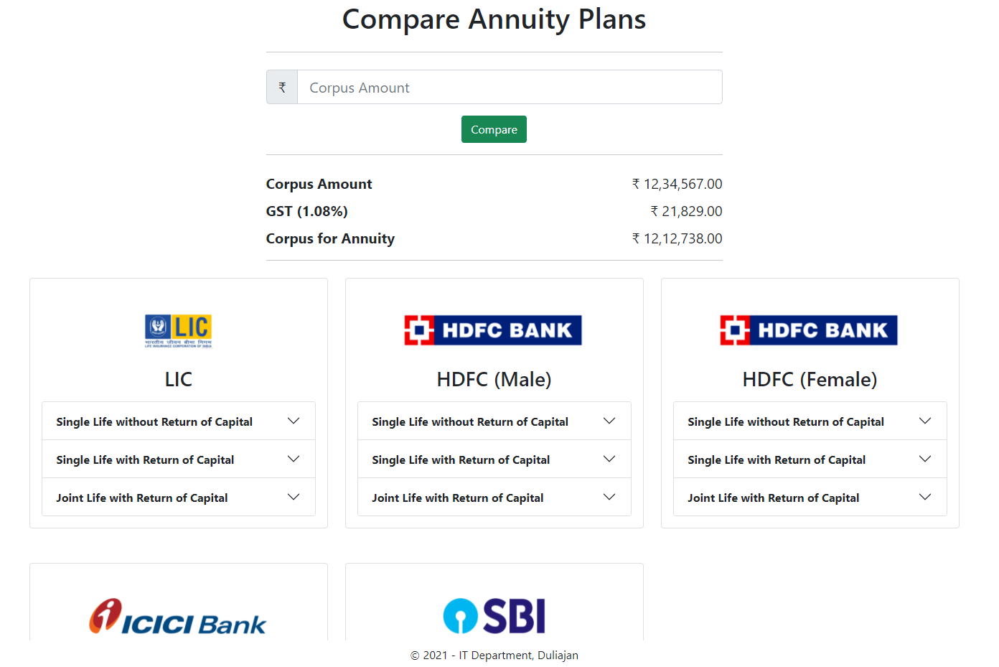
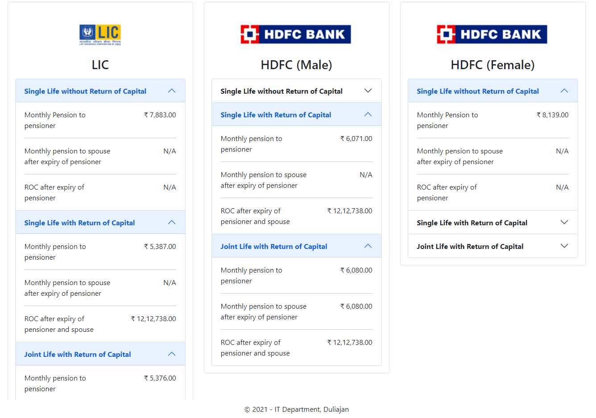
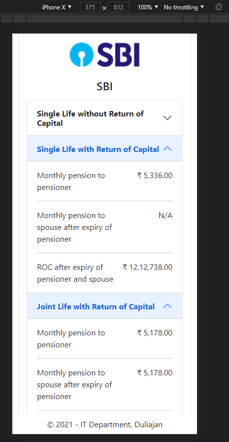

# Compare Annuity Plans

Front end code for displaying excessive information
Single page appilcation

### Bootstrap 5 components used
- Input
- Button
- Accordion

### Bootstrap 5 utilities used
- Positioning 
    * `fixed-top` 
    * `fixed-bottom`
- Spacing `{property}{sides}-{size}` 
    * `mb-1` sets bottom margin to 1unit
    * `mx-auto` handy for center alignment. Sets auto margin along x-axis
    * `pt-2` sets top padding to 2units
    * `my-4` sets top and bottom margin to 4units
- Display `d-{value}`
    * `d-none` to hide an element
    * `d-flex` sets display property to `flex`
    * `d-grid` sets display property to `grid`

Breakpoints used - `lg`, `md`, `sm`

### Output

